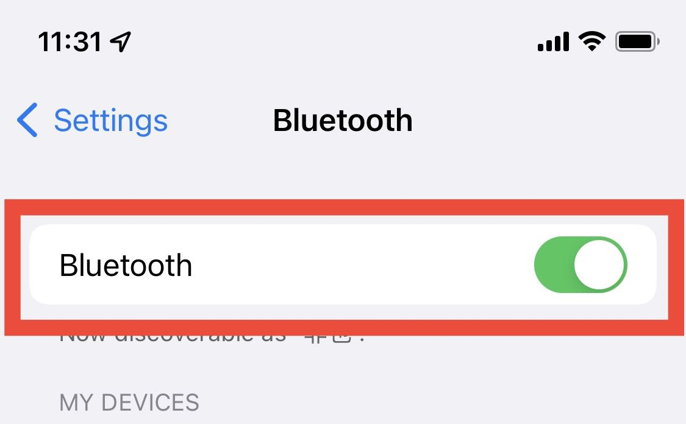
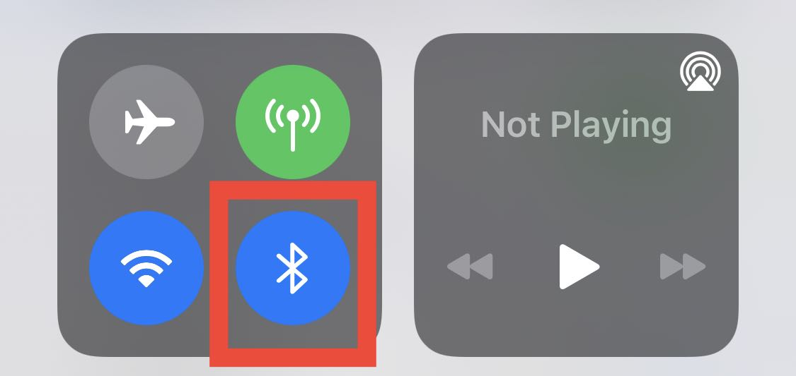

## How to turn on your phone's Bluetooth?
Open your phone's Settings app. Go to Bluetooth, and then turn on Bluetooth.

For iPhone, you also need to check if Bluetooth is turned on in Control Center.

> If you have any more questions or concerns, feel free to hit us up at customer@entertech.cn.  
> We're more than happy to help you out however we can and will get back to you as soon as possible.