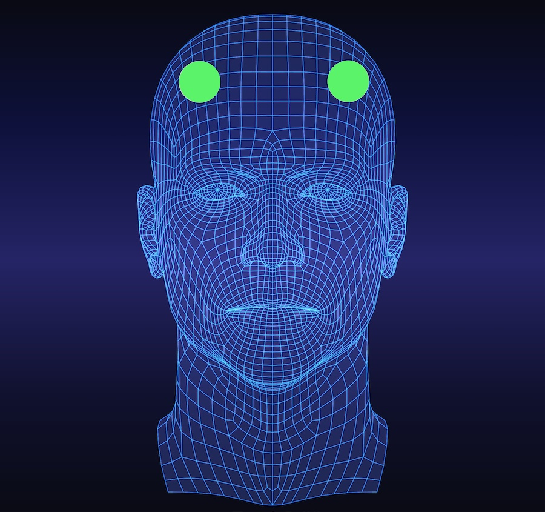
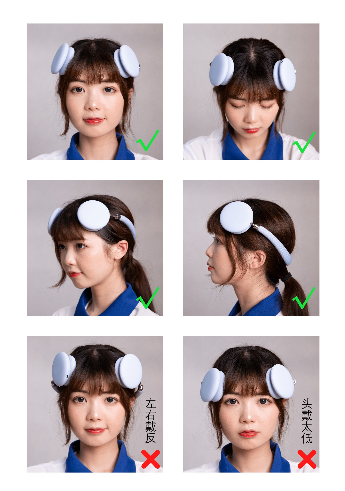

## How to Wear the Headset？

- The activation site of the small champion memory headset is shown in the figure above. Before each use, make sure that the scalp/skin near the activation site is clean and tidy, free of acne, acne, eczema, herpes, acne, blisters, cysts, scabs, redness, scalds, abscesses, etc. breaks/wounds. If you apply medicines/hair care products/cosmetics, etc., please clean it with wet wipes first.
- Remove hair clips, hair bands and other wearing items.
- If there is a lot of hair on the forehead, it is recommended to arrange the hair with a hair ring first to make the forehead hair neat.
- Wear the headwear from front to back. The headwear is divided into left and right. When properly worn, the charging port is on the left side, and the "Small champion" logo is facing upwards and located on the right side of the head beam.
- By adjusting the angle of the head beam and the length of the telescopic rod, the headwear is worn at the activation site.
- You can confirm the correct wearing position through a mirror or with the help of family members. When viewed from the front, the discs on both sides of the headwear are symmetrical.  

-Adjust the angle of the headwear disc and press the headwear evenly to make the sponge sheet and the scalp/skin fully contact.
-It is still not in good contact after pressing, you can adjust the position of the head and wear it near the hairline.  
