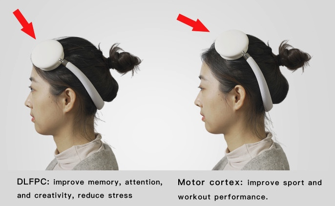

## How to Wear the Headset？

- The activation sites are shown above. Before each use, make sure that the scalp/skin near the activation site is clean and tidy, free of acne, acne, eczema, herpes, acne, blisters, cysts, scabs, redness, scalds, abscesses, breaks/wounds, etc. If you've applied medicines/hair care products/cosmetics, etc., please clean it with wet wipes first.
- Remove hair clips, hair bands, and other items near the site.
- If you have thick hair on the forehead, it is recommended to fix it to make the forehead neat.
<iframe
    width="100%"
    height="500"
    src="https://www.youtube.com/embed/X0Hsq6XXCZ0"
    frameborder="0"
    allow="accelerometer; autoplay; clipboard-write; encrypted-media; gyroscope; picture-in-picture"
    allowfullscreen
></iframe>
- Wear the headset from front to back. The charging port is on your left side when the headset is worn correctly.
- You can adjust the angle of the head rings and the arms' length to position the electrode pads in place.
- You may wear it in the mirror if you are not sure. 
  <iframe
    width="100%"
    height="500"
    src="https://www.youtube.com/embed/u822gkKaTn4"
    frameborder="0"
    allow="accelerometer; autoplay; clipboard-write; encrypted-media; gyroscope; picture-in-picture"
    allowfullscreen
></iframe>

- After the pads are placed well, press the headset evenly to make the sponge pads are in full contact with and the scalp/skin.
- If it is still not in good contact, move the pads to the forehead near the hairline.  

> If you have any more questions or concerns, feel free to hit us up at customer@entertech.cn.  
> We're more than happy to help you out however we can and will get back to you as soon as possible.