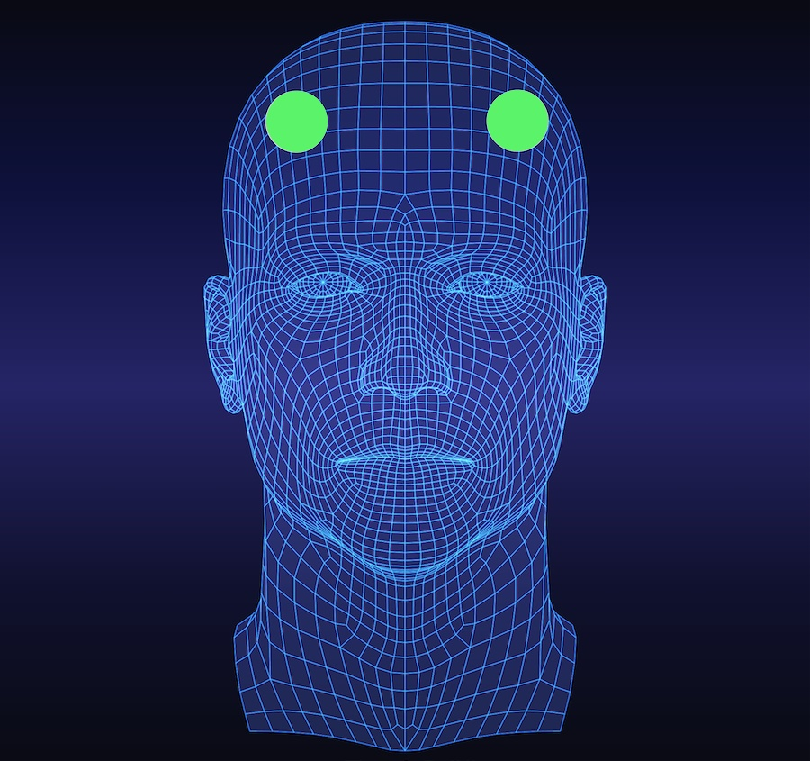

## 如何佩戴头戴？

- 小状元记忆头戴的激活位点如上图。每次使用前确保激活位点附近的头皮/皮肤干净整洁，无痘痘、粉刺、湿疹、疱疹、痤疮、水泡、囊肿、结痂、红肿、烫伤、脓肿等破损/创伤。如果有涂抹药品/护发产品/化妆品等，请先用湿巾清洁。
- 取下发夹、发箍等佩戴物。
- 如果前额头发较多，建议先用发圈整理好头发，使前额头发整齐。
- 从前往后佩戴头戴，头戴分左右，正确佩戴时「小状元」logo 正向朝上，位于头梁右侧。
- 通过调整头梁角度和伸缩杆长度，将头戴佩戴于激活位点。
- 可通过镜子，或由家人帮忙确认佩戴位置正确。正面看头戴两侧圆盘左右对称，头戴不会过低，头戴两圆盘距离不会过近。
- 调节头戴圆盘角度，均匀按压头戴，使海绵片和与头皮/皮肤充分接触。
- 按压后仍然未接触好，可以调整头戴位置，佩戴于发际线附近。